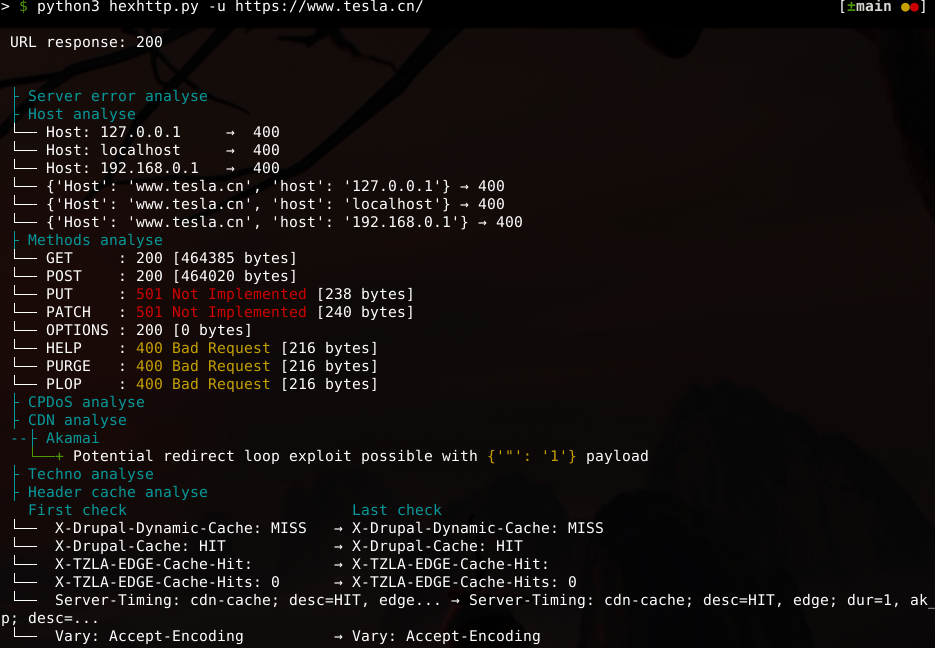

# HExHTTP

> HExHTTP is a tool designed to perform tests on HTTP headers and analyze the results to identify vulnerabilities and interesting behaviors.

<div align="center">


</div>

## Installation

### Python

```bash
pip install -r requirements.txt
./hexhttp.py -u 'https://target.tld/'
```

### Docker

```bash
docker build -t hexhttp:latest .
docker run --rm -it --net=host -v "$PWD:/hexhttp/" hexhttp:latest -u 'https://target.tld/'
```

## Usage

```bash
usage: hexhttp.py [-h] [-u URL] [-f URL_FILE] [-H CUSTOM_HEADER] [-F] [-a AUTH] [-b]

HExHTTP is a tool designed to perform tests on HTTP headers.

options:
  -h, --help            show this help message and exit
  -u URL, --url URL     URL to test [required]
  -f URL_FILE, --file URL_FILE
                        File of URLs
  -H CUSTOM_HEADER, --header CUSTOM_HEADER
                        Add a custom HTTP Header
  -F, --full            Display the full HTTP Header
  -a AUTH, --auth AUTH  Add an HTTP authentication. Ex: --auth admin:admin
  -b, --behavior        Activates a simplified version of verbose, highlighting interesting cache behaviors
```

### Arguments

```bash
# Scan only one domain
» ./hexhttp.py -u 'https://target.tld/'

# Scan a list of domains with behavior feature
» ./hexhttp.py -b -f domains.lst

# Use a custom Header and authentication
» ./hexhttp.py --header 'User-Agent: Mozilla/5.0 (X11; Ubuntu; Linux x86_64) Firefox/123.0-BugBounty' --auth 'user:passwd' -u 'https://target.tld/' 
```

## Examples

### Exemple 1


### Exemple 2 


### Exemple with a confirmed Cache Poisoning vulnerabity


### Excepted results

You can test this tool on the Web Security Academy's vulnerable labs, like this one. The expected result should be the same as above.

- [Web cache poisoning with an unkeyed header](https://portswigger.net/web-security/web-cache-poisoning/exploiting-design-flaws/lab-web-cache-poisoning-with-an-unkeyed-header)

## Features

- Server Error response checking
- Localhost header response analysis
- Vhosts checking
- Methods response analysis
- HTTP version analysis **[Experimental]**
- CPDoS technique
- Web cache poisoning
- Range poisoning/error (416 response error) **[Experimental]**
- Cookie Reflection
- CND/proxies Analysis (Envoy/Apache/Akamai/Nginx) **[IP]**

## TODO

- [ ] Try with mobile user-agent 
- [ ] https://youst.in/posts/cache-key-normalization-denial-of-service/ [IP]
- [ ] Filter False Positive on WAF blocking
- [ ] Pypi package

### Based on
- [YWH HTTP Header Exploitation](https://blog.yeswehack.com/yeswerhackers/http-header-exploitation/)
- [Cache Poisoning at Scale](https://youst.in/posts/cache-poisoning-at-scale/)
- [Web Cache Entanglement: Novel Pathways to Poisoning](https://portswigger.net/research/web-cache-entanglement)
- [Practical Web Cache Poisoning](https://portswigger.net/research/practical-web-cache-poisoning)
- [Exploiting cache design flaws](https://portswigger.net/web-security/web-cache-poisoning/exploiting-design-flaws)
- [Responsible denial of service with web cache poisoning](https://portswigger.net/research/responsible-denial-of-service-with-web-cache-poisoning)
- [CPDoS.org](https://cpdos.org/)
- [Autopoisoner](https://github.com/Th0h0/autopoisoner)

## Contributing

Pull requests are welcome. Feel free to contribute to this tool and make improvements!