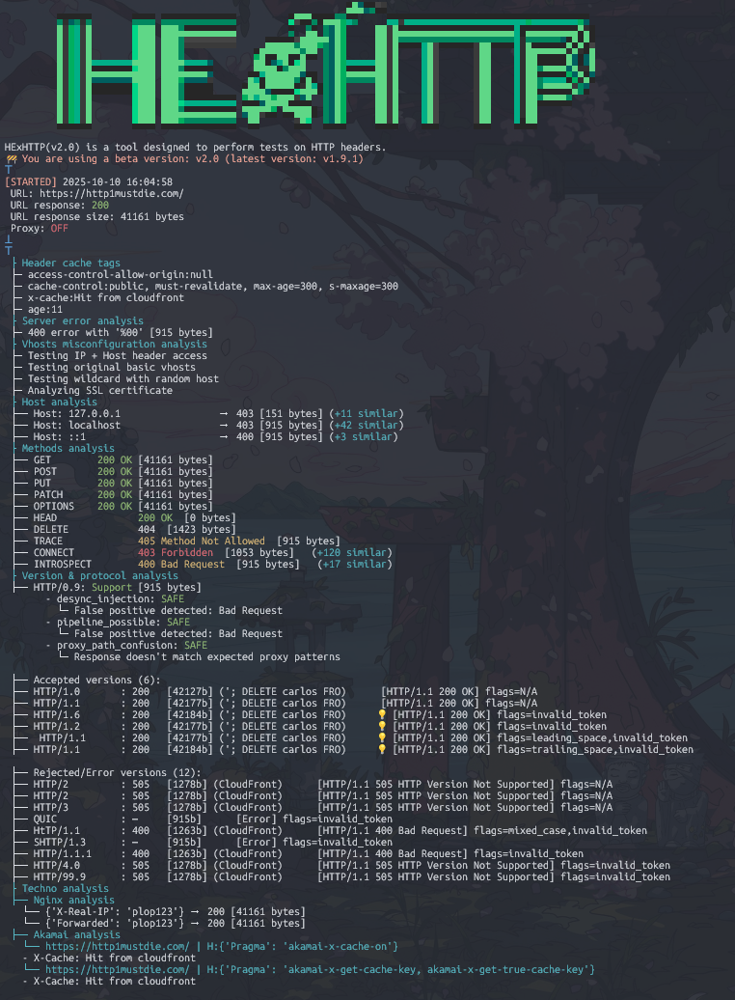
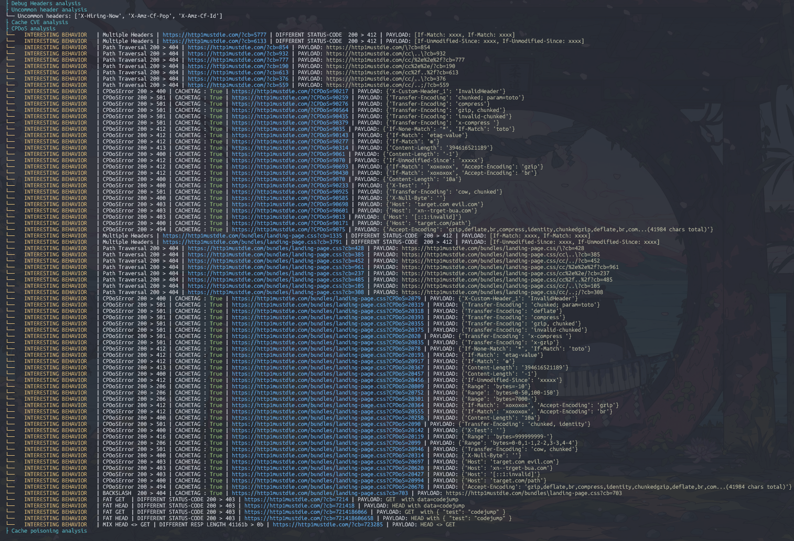
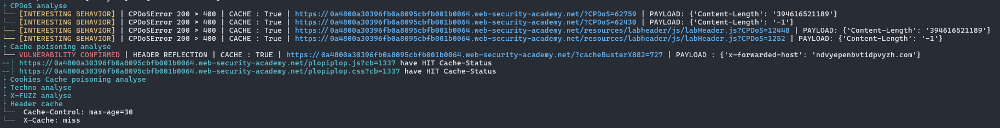

# HExHTTP

<p align="center">
  
</p>

> HExHTTP is a tool designed to perform tests on HTTP headers and analyze the results to identify vulnerabilities and interesting behaviors.

<div align="center">


</div>

<br>

<p align="center">
  <a href="https://github.com/c0dejump/HExHTTP/blob/main/CHANGELOG.md">📰 News</a> |
  <a href="https://github.com/c0dejump/HExHTTP/#installation">⚙️ Installation</a> |
  <a href="https://github.com/c0dejump/HExHTTP/#usage">💻 Usage</a> |
  <a href="https://github.com/c0dejump/HExHTTP/#exemples">🧩 Exemples</a> |
  <a href="https://github.com/c0dejump/HExHTTP/#features">🚀 Features</a> |
  <a href="https://github.com/c0dejump/HExHTTP/#todo">🧠 TODO</a>
</p>


## Installation


Follow these steps to install **HExHTTP**:

1. **Clone the repository** to your local machine:
   ```bash
   git clone https://github.com/c0dejump/HExHTTP.git
   ```
2. **Change Directory**   
   ```bash
   cd HExHTTP
   ```
3. **Install** the required dependencies:
   ```bash
   pip install .
   ```
  - dev mod
   ```bash
   pip install -e ".{dev]"
   ```
4. **Ensure HExHTTP** is running correctly:
   ```bash
   ./hexhttp.py -u 'https://target.tld/'
      # OR
   python3 hexhttp.py -u 'https://target.tld/'
   ```

Or you can do ```pip install hexhttp```

For More Advanced use, Check [Usage](#usage) section below.

### Docker

```bash
docker build -t hexhttp:latest .
docker run --rm -it --net=host -v "$PWD:/hexhttp/" hexhttp:latest -u 'https://target.tld/'
```

## Burp Suite Integration Setup
Prerequisites:
- Burp Suite Community or Professional
- Python 3.x
- Jython (for Burp extensions)

#### Install the Custom Extension
  Download the Extension ./utils/burp_extension_issue.py

  In Burp Suite, go to *Extensions > Add*

  Select Python as the extension type
  ```
  > Click Select file and choose burp_extension_issue.py
  > Click Next and then Close
  ```
  Verify the extension is loaded in the Extensions tab

#### Using Burp Proxy Integration
HExHTTP now supports flexible proxy configuration:

```bash
# Send behavior and confirmed findings to Burp (default: 127.0.0.1:8080)
» ./hexhttp.py -u 'https://target.tld/' --burp

# Use custom Burp proxy address
» ./hexhttp.py -u 'https://target.tld/' --burp 192.168.1.100:8080

```

When using `--burp`, HExHTTP will automatically create issues in Burp Suite for:
- **Behavior findings**: Medium severity issues
- **Confirmed vulnerabilities**: High severity issues

## Proxy Configuration

HExHTTP supports flexible proxy configuration for different use cases:

#### General Proxy (`--proxy`)
Routes all HTTP requests through the specified proxy server:
```bash
# Custom proxy server
» ./hexhttp.py -u 'https://target.tld/' --proxy 10.0.0.1:3128

# Default proxy (127.0.0.1:8080)
» ./hexhttp.py -u 'https://target.tld/' --proxy
```

#### Combined Usage
Use both options for maximum flexibility:
```bash
# Route all traffic through a corporate proxy, but send findings to Burp
» ./hexhttp.py -u 'https://target.tld/' --proxy corporate.proxy:3128 --burp 127.0.0.1:8080
```

#### Supported Formats
- `host:port` - e.g., `127.0.0.1:8080`
- `host` - uses default port 8080, e.g., `localhost`
- `http://host:port` - full URL format
- `https://host:port` - HTTPS proxy support

## Usage

```bash
usage: hexhttp.py [-h] [-u URL] [-f URL_FILE] [-H CUSTOM_HEADER] [-A USER_AGENT] [-a AUTH] [-hu HUMANS] [-t THREADS] [-l LOG] [-L LOG_FILE] [-v] [-p [PROXY]] [--burp [BURP]] [--ocp]

HExHTTP(v2.3) is a tool designed to perform tests on HTTP headers.

options:
  -h, --help            show this help message and exit

> General:
  -u URL, --url URL     URL to test [required] if no -f/--file provided
  -f URL_FILE, --file URL_FILE
                        File of URLs

> Request Settings:
  -H CUSTOM_HEADER, --header CUSTOM_HEADER
                        Add a custom HTTP Header
  -A USER_AGENT, --user-agent USER_AGENT
                        Add a custom User Agent
  -a AUTH, --auth AUTH  Add an HTTP authentication. Ex: --auth admin:admin
  -hu HUMANS, --humans HUMANS
                        Performs a timesleep to reproduce human behavior (Default: 0s) value: 'r' or 'random'
  -t THREADS, --threads THREADS
                        Threads numbers for multiple URLs. Default: 10

> Log settings:
  -l LOG, --log LOG     Set the logging level (DEBUG, INFO, WARNING, ERROR, CRITICAL)
  -L LOG_FILE, --log-file LOG_FILE
                        The file path pattern for the log file. Default: logs/
  -v, --verbose         Increase verbosity (can be used multiple times)

> Proxy Settings:
  -p [PROXY], --proxy [PROXY]
                        Proxy all requests through this proxy (format: host:port, default: 127.0.0.1:8080)
  --burp [BURP]         Send behavior and confirmed requests to Burp proxy (format: host:port, default: 127.0.0.1:8080)

> Tips:
  --ocp, --only-cp      Only cache poisoning modules

```

### Arguments

```bash
# Scan only one domain
» ./hexhttp.py -u 'https://target.tld/'

# Scan a list of domains with behavior feature
» ./hexhttp.py -f domains.lst

# if the application is very sensitive (waf or not)
» ./hexhttp.py -u 'https://target.tld/' -hu r

# Add custom User-Agent
» ./hexhttp.py -u 'https://target.tld/' --user-agent "Mozilla/5.0 (X11; Ubuntu; Linux x86_64) Firefox/123.0-BugBounty"

# Use a custom Header and authentication
» ./hexhttp.py --header 'Foo: bar' -H 'plip: plop' --auth 'user:passwd' -u 'https://target.tld/' 

# Proxy all requests through a custom proxy
» ./hexhttp.py -u 'https://target.tld/' --proxy 127.0.0.1:8080

# Send interesting findings to Burp Suite for analysis
» ./hexhttp.py -u 'https://target.tld/' --burp 127.0.0.1:8080

# Use both general proxy and Burp (general traffic through proxy, findings to Burp)
» ./hexhttp.py -u 'https://target.tld/' --proxy 10.0.0.1:3128 --burp 127.0.0.1:8080

# Use default Burp proxy (127.0.0.1:8080)
» ./hexhttp.py -u 'https://target.tld/' --burp

```

## Examples

### Example on a public target



### Example with a confirmed Cache Poisoning vulnerability
You can test this tool on the Web Security Academy's vulnerable labs, like [Web cache poisoning with an unkeyed header](https://portswigger.net/web-security/web-cache-poisoning/exploiting-design-flaws/lab-web-cache-poisoning-with-an-unkeyed-header). The expected result should be the same as below.



### TOOL TIPS
- If the base URL responds with a 403, try removing the comments in hexhttp.py (search DECOMMENTHIS) and restarting.

## Features

- Server Error response checking
- Vhosts checking
- Localhost header response analysis
- Methods response analysis
- HTTP Version & protocol analysis **[Experimental]**
- CDN/proxies Analysis (Envoy/Apache/Akamai/Nginx) **[WIP]**
- Debug headers analysis
- Uncommon headers analysis
- HTTP type CVE checking
- Cache Poisoning DoS (CPDoS) techniques
- Web cache poisoning
- **Flexible Proxy Support** (General proxy + Burp Suite integration)
- [X] Human scan (rate limiting + timeout randomization ) [WIP] -- works but cleaning, linting etc...

## TODO

- [ ] Remake "session" handler/wrapper
- [ ] Filter False Positive on WAF blocking [WIP]
- [ ] Make the arguments "global" to avoid calling them in each functions, which will make the script simpler and cleaner.
- [ ] Prioritize scans to quickly test the main cache poisoning vectors before being triggered by the WAF
- [ ] Add a depth option to scans of "static" files (js/css, etc.)
- [ ] Host Header Injection analysis
- [ ] Parameter Cloacking
- [ ] Tests Bed for regression testing
- [ ] Different Output formats (eg, JSON, JSONL, TXT)

### Based on
- [YWH HTTP Header Exploitation](https://blog.yeswehack.com/yeswerhackers/http-header-exploitation/)
- [Cache Poisoning at Scale](https://youst.in/posts/cache-poisoning-at-scale/)
- [abusing http hop-by-hop request headers](https://nathandavison.com/blog/abusing-http-hop-by-hop-request-headers)
- [Web Cache Entanglement: Novel Pathways to Poisoning](https://portswigger.net/research/web-cache-entanglement)
- [Practical Web Cache Poisoning](https://portswigger.net/research/practical-web-cache-poisoning)
- [Exploiting cache design flaws](https://portswigger.net/web-security/web-cache-poisoning/exploiting-design-flaws)
- [Responsible denial of service with web cache poisoning](https://portswigger.net/research/responsible-denial-of-service-with-web-cache-poisoning)
- [CPDoS.org](https://cpdos.org/)
- [Autopoisoner](https://github.com/Th0h0/autopoisoner)
- [Rachid.A research](https://zhero-web-sec.github.io/research-and-things/)

## Contributing

Pull requests are welcome. Feel free to contribute to this tool and make improvements!