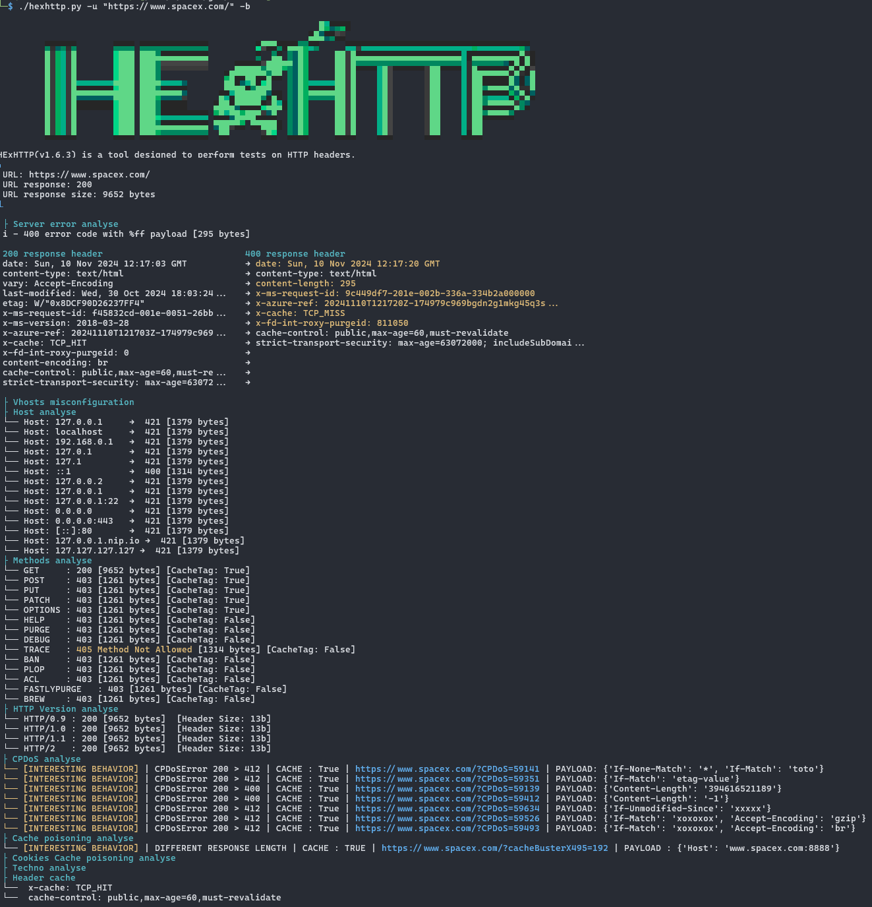
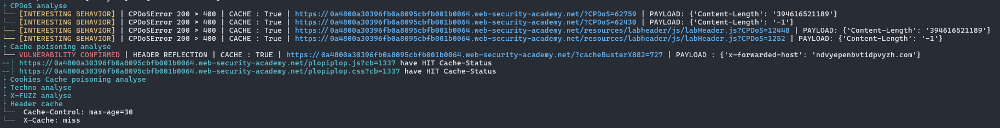

# HExHTTP


> HExHTTP is a tool designed to perform tests on HTTP headers and analyze the results to identify vulnerabilities and interesting behaviors.

<div align="center">


</div>

## Installation


Follow these steps to install **HExHTTP**:

1. **Clone the repository** to your local machine:
   ```bash
   git clone https://github.com/c0dejump/HExHTTP.git
   ```
2. **Change Directory**   
   ```bash
   cd HExHTTP
   ```
3. **Install** the required dependencies:
   ```bash
   pip install -r requirements.txt
   ```
4. **Ensure HExHTTP** is running correctly:
   ```bash
   ./hexhttp.py -u 'https://target.tld/'
      # OR
   python3 hexhttp.py -u 'https://target.tld/'
   ```

Or you can do ```pip install hexhttp```

For More Advanced use, Check [Usage](#usage) section below.

### Docker

```bash
docker build -t hexhttp:latest .
docker run --rm -it --net=host -v "$PWD:/hexhttp/" hexhttp:latest -u 'https://target.tld/'
```

## Usage

```bash
Usage: hexhttp.py [-h] [-u URL] [-f URL_FILE] [-H CUSTOM_HEADER] [-A USER_AGENT] [-F] [-a AUTH] [-b] [-hu HUMANS] [-t THREADS] [-l LOG] [-L LOG_FILE] [-v] [-p CUSTOM_PROXY]

HExHTTP is a tool designed to perform tests on HTTP headers.

options:
  -h, --help            show this help message and exit
  -u, --url URL         URL to test [required]
  -f, --file URL_FILE   File of URLs
  -H, --header CUSTOM_HEADER
                        Add a custom HTTP Header
  -A, --user-agent USER_AGENT
                        Add a custom User Agent
  -F, --full            Display the full HTTP Header
  -a, --auth AUTH       Add an HTTP authentication. Ex: --auth admin:admin
  -b, --behavior        Activates a simplified version of verbose, highlighting interesting cache behaviors
  -hu, --humans HUMANS  Performs a timesleep to reproduce human behavior (Default: 0s) value: 'r' or 'random'
  -t, --threads THREADS
                        Threads numbers for multiple URLs. Default: 10
  -l, --log LOG         Set the logging level (DEBUG, INFO, WARNING, ERROR, CRITICAL)
  -L, --log-file LOG_FILE
                        The file path pattern for the log file. Default: logs/
  -v, --verbose         Increase verbosity (can be used multiple times)
  -p, --proxy CUSTOM_PROXY
                        Add a custom proxy. Ex: http://127.0.0.1:8080

```

### Arguments

```bash
# Scan only one domain
» ./hexhttp.py -u 'https://target.tld/'

# Scan a list of domains with behavior feature
» ./hexhttp.py -b -f domains.lst

# if the application is very sensitive (waf or not)
» ./hexhttp.py -u 'https://target.tld/' -hu r

# Add custom User-Agent
» ./hexhttp.py -u 'https://target.tld/' --user-agent "User-Agent: Mozilla/5.0 (X11; Ubuntu; Linux x86_64) Firefox/123.0-BugBounty"

# Use a custom Header and authentication
» ./hexhttp.py --header 'Foo: bar' --auth 'user:passwd' -u 'https://target.tld/' 

# Loop on domains, grep for vulnerabilities only and send result with notify (from projectdiscovery)
» for domain in $(cat domains.lst); do ./hexhttp.py -u "$domain" | grep -Eio "(INTERESTING|CONFIRMED)(.*)PAYLOAD.?:(.*){5,20}$" | notify -silent; done

```

## Examples

### Example on a public target


### Example with a confirmed Cache Poisoning vulnerability
You can test this tool on the Web Security Academy's vulnerable labs, like [Web cache poisoning with an unkeyed header](https://portswigger.net/web-security/web-cache-poisoning/exploiting-design-flaws/lab-web-cache-poisoning-with-an-unkeyed-header). The expected result should be the same as below.



## Features

- Server Error response checking
- Localhost header response analysis
- Vhosts checking
- Methods response analysis
- HTTP Version analysis **[Experimental]**
- Cache Poisoning DoS (CPDoS) techniques
- Web cache poisoning
- HTTP type CVE checking
- Cookie Reflection
- CDN/proxies Analysis (Envoy/Apache/Akamai/Nginx) **[WIP]**

## TODO

- [ ] Filter False Positive on WAF blocking [WIP]
- [ ] Code Linting & Optimization [WIP]
- [ ] Parameter Cloacking
- [X] Human scan (rate limiting + timeout randomization ) [WIP] -- works but cleaning, linting etc...
- [ ] Try with mobile user-agent
- [ ] Tests Bed for regression testing
- [ ] Different Output formats (eg, JSON, JSONL, TXT)

### Based on
- [YWH HTTP Header Exploitation](https://blog.yeswehack.com/yeswerhackers/http-header-exploitation/)
- [Cache Poisoning at Scale](https://youst.in/posts/cache-poisoning-at-scale/)
- [abusing http hop-by-hop request headers](https://nathandavison.com/blog/abusing-http-hop-by-hop-request-headers)
- [Web Cache Entanglement: Novel Pathways to Poisoning](https://portswigger.net/research/web-cache-entanglement)
- [Practical Web Cache Poisoning](https://portswigger.net/research/practical-web-cache-poisoning)
- [Exploiting cache design flaws](https://portswigger.net/web-security/web-cache-poisoning/exploiting-design-flaws)
- [Responsible denial of service with web cache poisoning](https://portswigger.net/research/responsible-denial-of-service-with-web-cache-poisoning)
- [CPDoS.org](https://cpdos.org/)
- [Autopoisoner](https://github.com/Th0h0/autopoisoner)
- [Rachid.A research](https://zhero-web-sec.github.io/research-and-things/)

## Contributing

Pull requests are welcome. Feel free to contribute to this tool and make improvements!